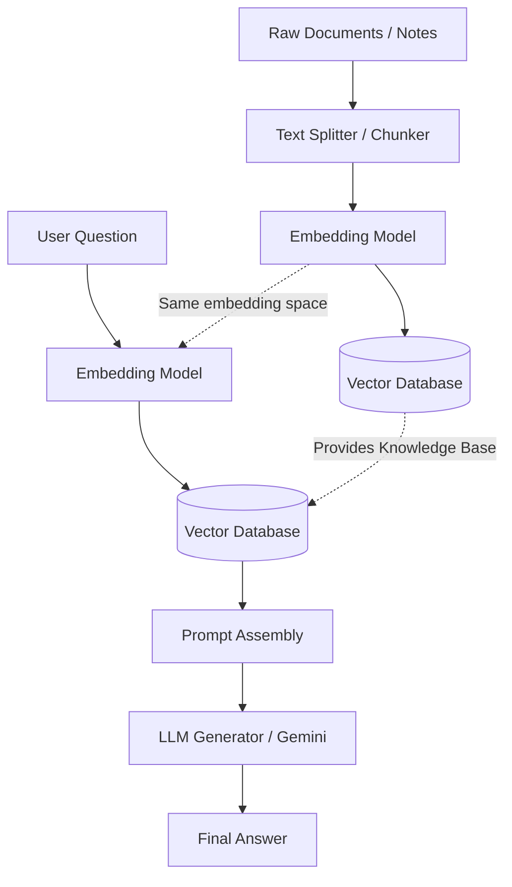

# Retrieval-Augmented Generation (RAG) Architecture

Understanding the high-level architecture is the most valuable part of RAG. You can always look up the specific code syntax later, but knowing *how the data flows* is what makes you an AI engineer.

A RAG system always operates in two distinct phases: **Phase 1: Ingestion** (saving the knowledge) and **Phase 2: Retrieval & Generation** (answering the question).

### Key Architectural Concepts

1. **Chunking**: LLMs have a "context window" (a memory limit). We can't feed a whole database into it at once. We break documents into "chunks" so we only send the highly relevant pieces.
2. **Embeddings**: An embedding is an array of floating-point numbers. It represents the *semantic meaning* of a text, allowing related text to be compared mathematically.
3. **Vector Database**: A specialized database such as ChromaDB stores embeddings and searches for nearby vectors efficiently.
4. **Prompt Assembly**: The application retrieves useful text and places it into a prompt with the user's question before sending the request to Gemini.

### Data Flow

The ingestion phase creates the searchable knowledge base. The query phase reuses that knowledge base to answer questions.

### Ingestion Contract

Each ingested chunk is stored with its source filename and chunk index. This metadata makes it possible for the application to identify where retrieved context came from when displaying sources.

### Chunking Strategy

The current application uses a simple fixed-size character window with overlap. The overlap helps preserve context when a sentence or idea crosses a chunk boundary.

### Embedding Model

The project uses the `all-MiniLM-L6-v2` sentence-transformer model for both document and query embeddings. Using the same embedding model for both sides keeps vectors in the same semantic space.
