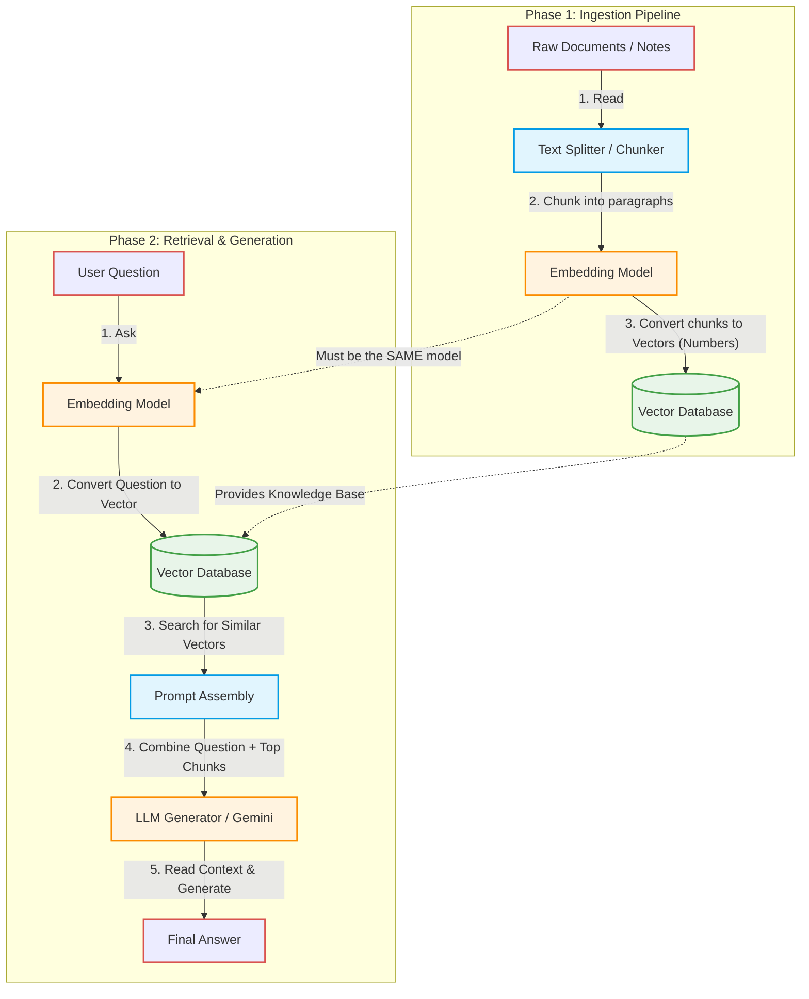

# Retrieval-Augmented Generation (RAG) Architecture

Understanding the high-level architecture is the most valuable part of RAG. You can always look up the specific code syntax later, but knowing *how the data flows* is what makes you an AI engineer.

A RAG system always operates in two distinct phases: **Phase 1: Ingestion** (saving the knowledge) and **Phase 2: Retrieval & Generation** (answering the question).

### Key Architectural Concepts

1. **Chunking**: LLMs have a "context window" (a memory limit). You can't feed a whole database into it at once. We break documents into "chunks" so we only send the highly relevant pieces.
2. **Embeddings**: An embedding is an array of floating-point numbers (e.g., `[0.12, -0.45, 0.89...]`). It represents the *semantic meaning* of a text. Words with similar meanings will have similar numbers.
3. **Vector Database**: A specialized database (like ChromaDB or Pinecone) designed purely to calculate the mathematical distance between arrays of numbers extremely fast.
4. **Prompt Assembly (The Magic Trick)**: RAG is essentially an illusion. The LLM isn't actually querying the database itself. *We* query the database, grab the text, and then build a prompt behind the scenes that looks like this:
   > *"Answer the question using this context: [Insert Database Results here]. Question: [User's Question]"*
